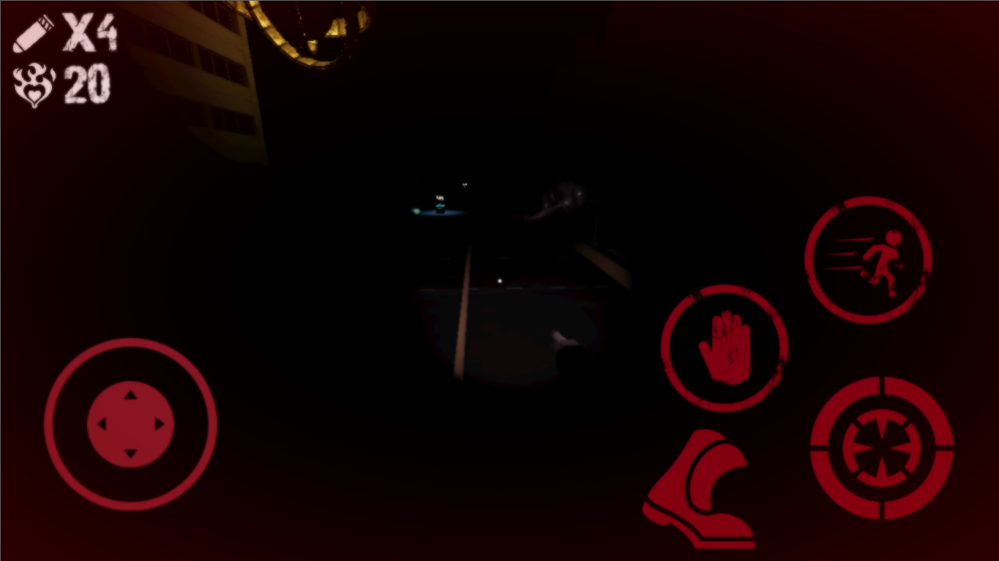

# Solemn Road: The Solana Mobile Horror Experience

**Solemn Road** is a first-person survival horror game built natively for **Solana Mobile**. You are thrust into a horrifi--uh I mean wonderful, unpredictable "game show" where your living depends not only on your reflexes but on your strategic survivial. Escape the abominations, manage your ammo, and survive the solemn road ahead.

---

## The Vision: Why Horror on Solana Mobile is Revolutionary

When we look at the mobile gaming landscape, **survival horror** has historically been a massive catalyst for driving app adoption. Titles like *Five Nights at Freddy's (FNAF)* didn't just sell copies; they created viral, cultural phenomena that drove millions of users to the app store simply to experience the terror and share it with their friends. 

**Web3 and Solana Mobile have yet to experience their "FNAF moment."** 

Right now, the Solana dApp Store is heavily populated by DeFi applications, casual clickers, and simple arcade games. **Solemn Road** changes the paradigm by bringing a high-fidelity, high-stakes, adrenaline-pumping horror experience directly to the Solana Saga and Seeker devices. 

### Why this changes everything:
* **High Stakes & Real Consequences:** Horror is about tension. By integrating Web3 mechanics (like our Hardcore betting system), the tension isn't just simulated—it's real. When you wager your tokens in Hardcore mode, every footstep, every shadow, and every missed shot carries real weight.
* **Viral Engine:** Horror games are inherently viral. Players love to record their scares, their close calls, and their tragic deaths. This organic content creation will serve as a massive onboarding funnel for the Solana Mobile ecosystem.
* **Proving the Hardware:** High-quality 3D survival horror pushes the boundaries of what mobile Web3 games can look and feel like, proving that the Solana Mobile platform is ready for "core" gamers, not just casuals.

*(Gameplay: Surviving the swarm with limited resources)*

---

## 🛠️ The Technology Stack

Solemn Road is built on a robust, cross-disciplinary tech stack designed for performance, security, and seamless Web3 integration.

* **Game Engine:** [Godot 4.4](https://godotengine.org/) (GL Compatibility for maximum mobile performance and rendering).
* **Smart Contracts / On-Chain Logic:** **Rust** & **Anchor Framework**. Used for processing Hardcore mode bets and secure on-chain interactions.
* **Web3 Integration:** **Solana SDK for Godot** & **Mobile Wallet Adapter (MWA)**. Allows seamless, frictionless transaction signing directly from the user's Solana Mobile device without breaking immersion.
* **Backend & Leaderboards:** **LootLocker**. Handles cross-session player data, competitive leaderboards, and secure off-chain data validation before interacting with our Solana programs.

---

## 🕹️ Features & Mechanics

* **Saga/Seeker Optimized:** Native Android build optimized specifically for the specs of Solana Mobile devices.
* **Hardcore Betting Mode:** Connect your wallet, wager your tokens, and see how far you can survive. If you die, the vault takes your bet. If you survive, you earn the right to the prize pool.
* **Dynamic AI Directors:** Enemies like the *Warden*, *Crawler*, and *Oraphim* have unique AI behaviors. Some stalk you when you aren't looking, some swarm you, and some will try to flank you.
* **Visceral Combat & Upgrades:** Smash crates, scavenge for ammo, choose dynamic powerups, and make every shot count.
* **Immersive Audio & Polish:** From the heavy breathing of your character as their health drops, to the dynamic death camera that simulates a physical collapse, every detail is designed to keep your heart rate up.

*(Death: "Killed by a warden.")*

---

## 🚀 Getting Started

### Prerequisites
* A Solana Mobile device (Saga or Seeker) or an Android emulator.
* A Solana Wallet installed on the device (e.g., Phantom, Solflare).

### Installation (APK)
1. Download the latest `SolemnRoad.apk` from the Releases tab.
2. Transfer and install the APK on your Android/Solana device.
3. Launch the app and connect your wallet when prompted.

### Building from Source
1. Clone the repository.
2. Open the project in Godot 4.4.
3. Ensure the Solana SDK and LootLocker SDK addons are activated in `Project -> Project Settings -> Plugins`.
4. Run the project to test on PC, or configure your Android export presets to build for mobile.

---

## 📜 License

This project is built for the Solana Mobile Hackathon. All game logic, smart contracts, and original assets are proprietary. Third-party visual and audio assets belong to their respective creators.
